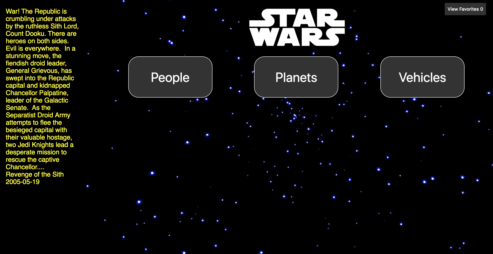

# SWAPI BOX

For this project, we are hitting The Star Wars API to tap into a “black hole” of Star Wars data. Mwahaha.

### How To Start Application

Clone down the repo

Run `npm install`

Run `npm start`

[Tory Dannenberg](https://github.com/tdberg21)

#### Landing Page:

#### People Data:

